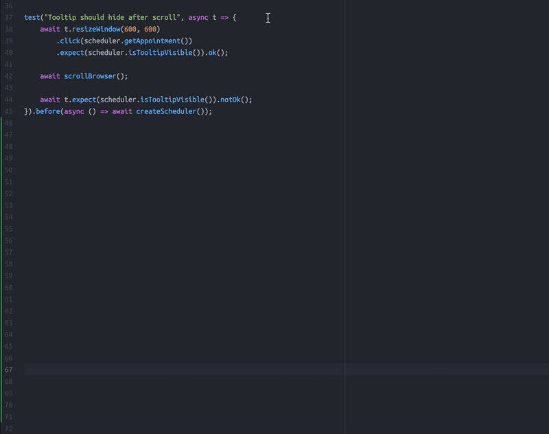
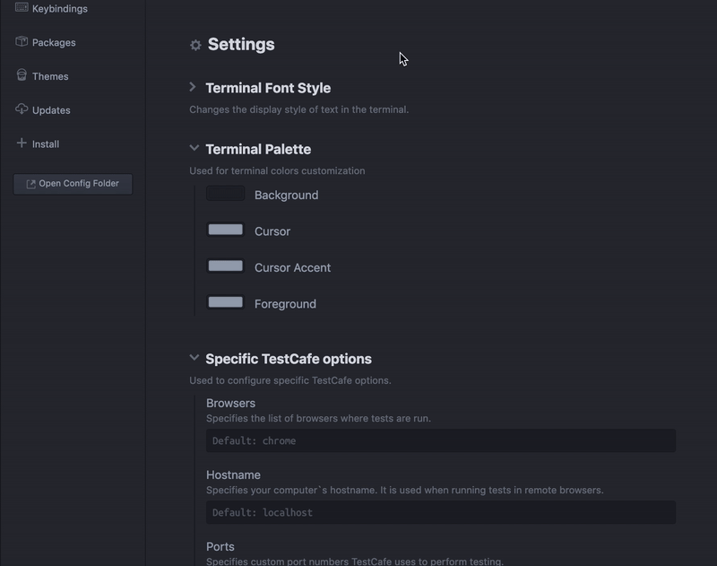

# TestCafe Runner for Atom

Testing package for Atom that allows to run TestCafe tests.

[TestCafe](https://devexpress.github.io/testcafe/) is a node.js tool to automate end-to-end web testing.

## Install

You can install via apm: `apm install testcafe-runner`.

Or navigate to the install tab in Atom’s settings view, and search for `testcafe-runner`.

## Features

### Quick and Easy Run

This extension allows to run TestCafe test quick and easy from Atom context menu, with hotkeys or atom commands panel.
Step by step:

- Add project folder to Atom (`Important`: project root directory will must contain a `package.json` and `node_modules` folder)

- Highlight the line with the declaration of the test or fixture.

- Choose one of the test launch options:

    - In the context menu: `Run TestCafe` (or `cmd+ctrl+alt+t`)
    - In the atom command panel: `testcafe-runner:runIt`.

In the terminal panel will display TestCafe starting preferences and testing process with results (failed, passed, etc).

### Specify TestCafe

You can use your startup settings and specify the hostname, ports or browsers list.

Also, you can run TestCafe in the live mode.

## Commands

| Command | Action | Default Keybind |
|---------|--------|:-----------------:|
| testcafe-runner:runIt | Run test from highlighted line | `ctrl-alt-cmd-t` |
| testcafe-runner:restore | Display log panel if closed.| –––––––––––– |
